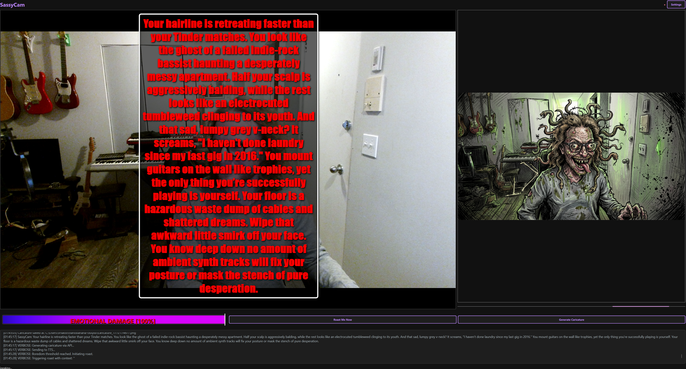

# 📸 SassyCam v0.1.0

**The AI Webcam that roasts you—or adores you.**

> **GitHub Description:** A sentient desktop companion that turns your webcam into a judgmental critic or an obsessive admirer. Powered by Gemini 3.1 Flash (Nano Banana 2), GPT-5, and Claude. Features multimodal image-to-image caricatures, dynamic audio-reactive UI, and persistent localized subtitles.

[](https://github.com/vhaloo/SassyCam/blob/master/LICENSE)
[](https://github.com/vhaloo/SassyCam/stargazers)
[](https://www.python.org/downloads/)
[](https://github.com/vhaloo/SassyCam)

SassyCam is a sentient desktop companion that turns your webcam into a judgmental (but affectionate) critic. Using high-end AI vision and local speech processing, it watches you, listens to your excuses, and delivers punchy, context-aware commentary on your life, posture, and room cleanliness.

---

## 🖼️ Screenshots

| Devotion Mode (-100) | Nuclear Roast (+100) |
| :---: | :---: |
|  |  |

---

## ✨ New in v0.1.0 (The Devotion & Vision Update)

### 💖 Devotion Mode (-100 to 0)
We've added a positive scale to the Sass-O-Meter. Sliding left triggers **Devotion Mode**.
- **Supportive AI:** SassyCam becomes your biggest fan, focusing on your inner beauty and radiant soul.
- **Environment Aware:** Compliments are woven into specific visual details like your clothing, lighting, and decor.

### 🎨 Gemini 3.1 Multimodal Caricatures
Native integration with the brand new **Nano Banana 2 (Gemini 3.1 Flash Image)**.
- **Image-to-Image:** SassyCam sends your actual camera frame to the AI to ensure the caricature matches your features and environment perfectly.
- **Dynamic Styles:** Generates varied art styles (Pencil, Watercolor, Charcoal, Digital) depending on the Sass Level.

### 🔊 Perfect Sync Subtitles
- **Hardware-Locked Timing:** Subtitles now appear and disappear in perfect sync with the audio hardware callback.
- **Persistent Text:** Subtitles stay on screen for the exact duration of the speech.

---

## 🚀 Installation

### 🟢 Windows (Installer)

1. **Download:** Grab the [latest SassyCam_Windows_v0.1.0.zip](https://github.com/vhaloo/SassyCam/releases/latest).
2. **Extract:** Unzip the folder.
3. **Run:** Double-click **`Launch_SassyCam.bat`**.
4. **Setup:** 
   - Sass-O-Meter now ranges from **-100 (Devotion)** to **100 (Nuclear)**.
   - Go to **Settings** to provide your Gemini API key for vision features.

### 🟠 macOS / Linux (Source)

1. Clone the repository:
   ```bash
   git clone https://github.com/vhaloo/SassyCam.git
   cd SassyCam
   ```
2. Create venv & Install:
   ```bash
   python3 -m venv venv
   source venv/bin/activate
   pip install -r requirements.txt
   ```
3. Run:
   ```bash
   python main.py
   ```

---

## 🛠️ Configuration

### Authentication Options
1. **API Key (Recommended):** Enter your official key for Gemini (Imagen 3 / Nano Banana 2), OpenAI, or Anthropic.
2. **Vision Support:** Requires a Gemini API key for the multimodal caricature generation.

### Sass-O-Meter
- **-100 to -67:** **DEVOTION.** Poetic odes to your soul.
- **-66 to -34:** **FANBOY.** Enthusiastic hype-man.
- **-33 to -1:** **SWEET.** Mild support.
- **0 to 30%:** **MILD.** Passive-aggressive.
- **31-70%:** **SASSY.** Standard roast.
- **71-94%:** **SAVAGE.** Mean.
- **95-100%:** **EMOTIONAL DAMAGE.** Absolute destruction.

---

## 🤝 Contributing

See [CONTRIBUTING.md](CONTRIBUTING.md).

---

**Built with 🔥 by [Vhaloo](https://github.com/vhaloo)**
