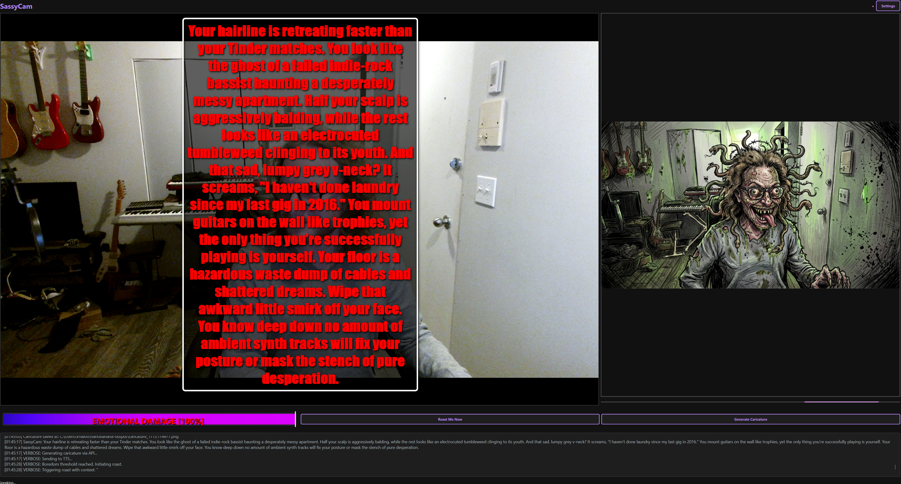

# 📸 SassyCam v0.1.2

**The AI Webcam that roasts you—or adores you.**

> **GitHub Description:** A sentient desktop companion that turns your webcam into a judgmental critic or an obsessive admirer. Powered by the **latest Gemini 3.1 Flash (Nano Banana 2)** for enhanced capabilities and performance, alongside GPT-5 and Claude. Features multimodal image-to-image caricatures, interactive art timeline, dynamic audio-reactive UI, and persistent localized subtitles.

[](https://github.com/vhaloo/SassyCam/blob/master/LICENSE)
[](https://github.com/vhaloo/SassyCam/stargazers)
[](https://www.python.org/downloads/)
[](https://github.com/vhaloo/SassyCam)

---

## 🖼️ Screenshots

| Devotion Mode (-100) | Nuclear Roast (+100) |
| :---: | :---: |
|  |  |

---

## ✨ New in v0.1.2 (The Interactive Gallery Update)

### 🎨 Interactive Caricature Gallery
- **Timeline Browsing**: Single-click any thumbnail in the bottom history bar to immediately show it in the large central view.
- **External View**: Double-click any caricature to open the high-resolution original in your system's default image viewer.
- **Adaptive Viewport**: The main display automatically resizes and scales your artwork to perfectly fit your window.
- **History Persistence**: SassyCam now remembers you. Your previous drawings are automatically loaded into the timeline every time you launch.

### 🔊 Enhanced Subtitles
- **Frame-Locked Alignment**: Subtitles are now pinned to the bottom of the caricature frame, ensuring they stay with the art even during window resizing.
- **Mood Styling**: Text fonts and colors now transition based on the AI's mood—elegant cursive for **Devotion**, aggressive Impact for **Roast**.

---

## 🚀 Installation Options

### 🟢 Windows (One-Click Installer - Recommended)
1.  **Download:** Download [Install_SassyCam.bat](https://github.com/vhaloo/SassyCam/blob/master/Install_SassyCam.bat).
2.  **Run:** Double-click it. It will automatically clone the repo, set up a virtual environment, install dependencies, and launch.

### 🔵 Standalone Binary (Windows Only)
1.  **Download:** Grab the [latest SassyCam_v0.1.2_Windows.zip](https://github.com/vhaloo/SassyCam/releases/latest).
2.  **Extract & Run:** Unzip and double-click `SassyCam.exe`. No Python or Git required!

### 🟠 macOS / Linux (Source)
1. Open your terminal and paste:
```bash
git clone https://github.com/vhaloo/SassyCam.git && cd SassyCam && python3 -m venv venv && source venv/bin/activate && pip install -r requirements.txt && python main.py
```

---

## 📋 Prerequisites (For neophytes)
You need two free tools installed on your computer to run the source version:
-   **Python 3.10+**: [Download here](https://www.python.org/downloads/) (Crucial: Check "Add Python to PATH" during installation).
-   **Git**: [Download here](https://git-scm.com/downloads).

---

## 🛠️ Configuration

### 1. API Keys
SassyCam requires a **Gemini API Key** for its vision and image generation features.
- Get a free key at **[Google AI Studio](https://aistudio.google.com/)**.
- Paste it into the **Settings** menu within the app.

### 2. Sass-O-Meter Guide
- **-100 to -67:** **DEVOTION.** Poetic odes to your soul.
- **-66 to -34:** **FANBOY.** Enthusiastic hype-man.
- **-33 to -1:** **SWEET.** Mild support.
- **0 to 100:** **SASSY to NUCLEAR.** Standard to absolute verbal destruction.

---

## ❓ Troubleshooting (Common Issues)

-   **"WinError 1114" (DLL Load Failed)**: This usually means a conflict with your graphics drivers or Python version. Ensure you are using Python 3.10-3.14 and have updated your Windows updates.
-   **Black Screen / No Camera**: Go to **Settings** and try a different **Camera Index** (0, 1, or 2).
-   **No Sound**: Ensure your output device is correct in **Settings**. The first time you use a new voice, it may take 10-20 seconds to download the voice file.
-   **No Caricature**: Ensure your **Gemini API Key** is correctly entered in Settings.

---

## 🤝 How to Contribute

We love community improvements! 
1.  **Report Bugs**: Open an [Issue](https://github.com/vhaloo/SassyCam/issues).
2.  **Suggest Features**: Want a new mode? Tell us in the issues!
3.  **Code**: Fork the repo, commit changes, and open a **Pull Request**.

---

**Built with 🔥 by [Vhaloo](https://github.com/vhaloo)**
